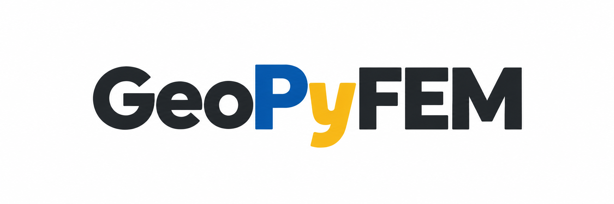

<p align="center">
  
</p>

<p align="center">
  <strong>An open-source Python finite element framework for computational geotechnics, education, research, and constitutive model development.</strong>
</p>

<p align="center">
  <em>GeoPyFEM is under active development.</em>
</p>

---

## About GeoPyFEM

**GeoPyFEM** is an open-source finite element framework written in Python with a focus on **computational geotechnics**.

The project is being developed as both:

- an educational platform for understanding the Finite Element Method from the implementation level,
- and a research-oriented codebase for experimenting with geotechnical constitutive models, nonlinear solution procedures, staged construction, and soil–structure problems.

Rather than treating the FEM solver as a black box, GeoPyFEM is intended to keep the main numerical procedures transparent and modular so that each part of the formulation can be studied, modified, and extended.

---

## Current Capabilities

GeoPyFEM currently includes or is being developed around the following capabilities:

- 2D continuum finite element analysis
- Linear elastic material formulation
- Nonlinear finite element solution framework
- Newton–Raphson iteration
- Incremental load advancement
- Gravity loading
- K0 initial stress generation
- Staged construction
- Element activation and deactivation
- Excavation through stress-release / holding-force procedures
- Gmsh mesh input
- XML-based problem definition
- Boundary conditions and distributed loads
- Internal force and global stiffness assembly
- State-variable management
- VTK output for post-processing in ParaView
- Displacement, strain, and stress post-processing infrastructure

The implementation is intentionally modular so that new elements, material models, solvers, loading procedures, and post-processing routines can be added independently.

---

## Project Structure

A simplified overview of the current source-code structure is:

```text
geopyfem/
├── assembly/            # Global stiffness, load vectors, and boundary conditions
├── elements/            # Element formulations, shape functions, and Gauss integration
├── hydraulic/           # Hydraulic-related modules
├── initial_stress/      # Initial stress procedures such as K0
├── material_model/      # Constitutive material models
├── stage/               # Staged construction, activation, deactivation, excavation
├── state/               # State-variable management
├── visualization/       # Post-processing and visualization utilities
│
├── gmsh_parser.py       # Gmsh mesh parser
├── mesh_checker.py      # Mesh checking and element-orientation utilities
├── problem_reader.py    # Problem/input-file reader
├── solver.py            # Global FEM solution procedures
└── main.py              # Main program entry point
```

The structure will continue to evolve as GeoPyFEM becomes more mature.

---

## Input Workflow

A typical GeoPyFEM analysis follows the workflow:

```text
Gmsh geometry
      │
      ▼
   .msh file
      │
      ▼
Mesh / physical-group parsing
      │
      ▼
XML problem definition
      │
      ▼
Finite element assembly
      │
      ▼
Nonlinear / linear solver
      │
      ▼
State update
      │
      ▼
VTK results
      │
      ▼
ParaView
```

The Gmsh file primarily defines the geometry, mesh, element groups, and boundary groups, while the XML problem file defines the analysis stages, materials, loads, boundary conditions, and other model settings.

---

## Running GeoPyFEM

Clone the repository:

```bash
git clone https://github.com/beprasetyo/geopyfem.git
cd geopyfem
```

Run an analysis using a GeoPyFEM XML problem file:

```bash
python3 main.py path/to/problem.xml
```

For example:

```bash
python3 main.py 2material_problem.xml
```

> The input format and installation procedure are still evolving. A more complete user guide and example collection will be added as the project matures.

---

## Example Problems

The repository contains development and verification models covering topics such as:

- linear elastic continuum problems,
- gravity loading,
- K0 initial stress,
- nonlinear material response,
- staged loading,
- groundwater-stage changes,
- embankment construction,
- element activation and deactivation,
- and excavation.

These examples are primarily used for code verification and development.

---

## Development Roadmap

Planned development includes:

- [ ] Improved automated verification and regression testing
- [ ] Expanded documentation and example problems
- [ ] Mohr–Coulomb elastoplastic model
- [ ] Robust stress-return algorithms for face, edge, and apex conditions
- [ ] Modified Cam Clay
- [ ] More advanced geotechnical constitutive models
- [ ] Coupled hydro-mechanical analysis
- [ ] Improved sparse-matrix assembly and solver performance
- [ ] Additional continuum element formulations
- [ ] More advanced staged-construction capabilities
- [ ] Improved ParaView / VTK post-processing
- [ ] Python package distribution

Longer-term development is intended to support advanced constitutive modelling for geotechnical research while keeping the implementation readable enough for teaching and learning.

---

## Design Philosophy

GeoPyFEM follows several guiding principles:

**Transparency**  
Numerical procedures should be understandable from the source code rather than hidden behind a large software abstraction layer.

**Modularity**  
Element formulations, material models, solvers, state management, loading procedures, and post-processing should remain as independent as practical.

**Geotechnical focus**  
Development priorities are driven primarily by problems in continuum geomechanics and computational geotechnics.

**Educational value**  
The code should remain useful for studying how finite element formulations are translated from equations into working numerical algorithms.

**Research extensibility**  
New constitutive models and numerical procedures should be implementable without rewriting the entire solver.

---

## Project Status

GeoPyFEM is currently an **experimental research and educational codebase**.

The software is under active development and has not yet been validated for use in production engineering design. Results should therefore be independently verified before being used for engineering decisions.

---

## Contributing

Contributions, discussions, bug reports, benchmark problems, and suggestions are welcome.

As the project structure stabilizes, dedicated contribution guidelines and testing requirements will be added.

---

## Author

**Bagus Eko Prasetyo**

GeoPyFEM is developed as an open-source project focused on finite element implementation and computational geotechnics.

---

## Citation

A formal citation will be provided when the first public GeoPyFEM software release and associated documentation are archived.

---

## License

A software license will be added as the public release structure is finalized.

