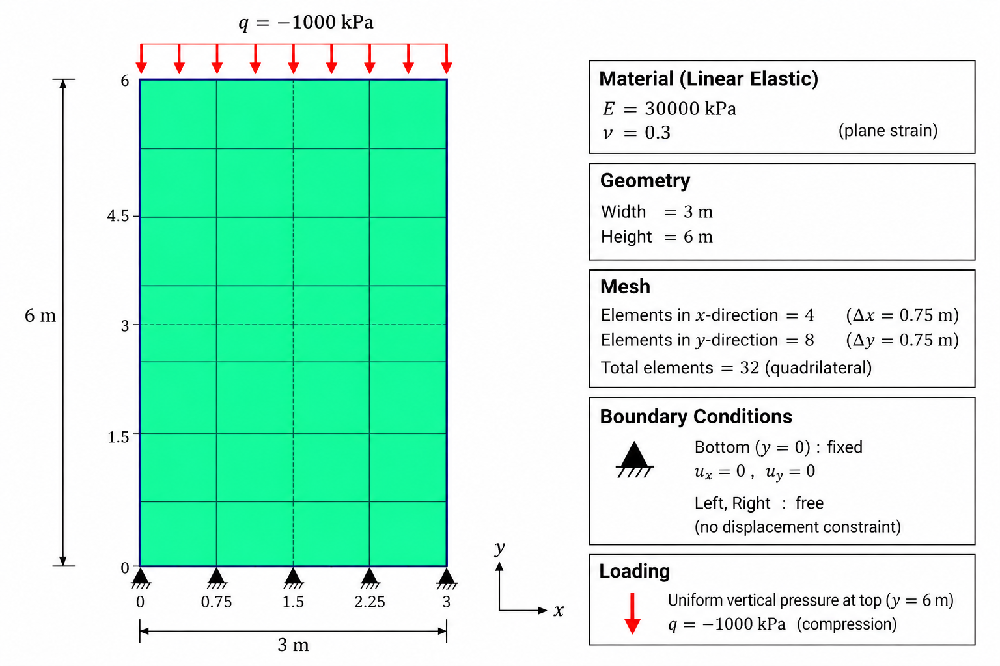
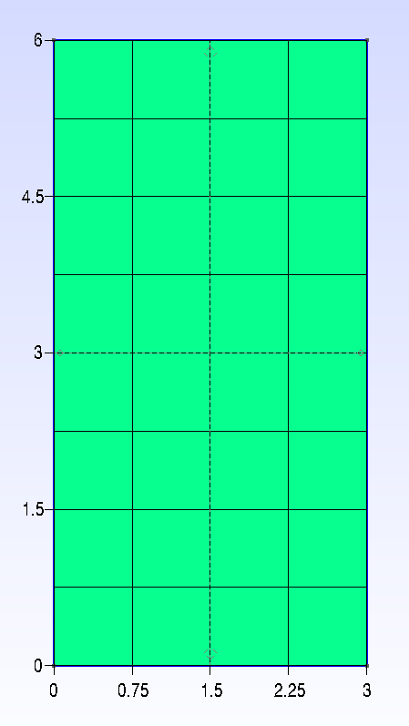
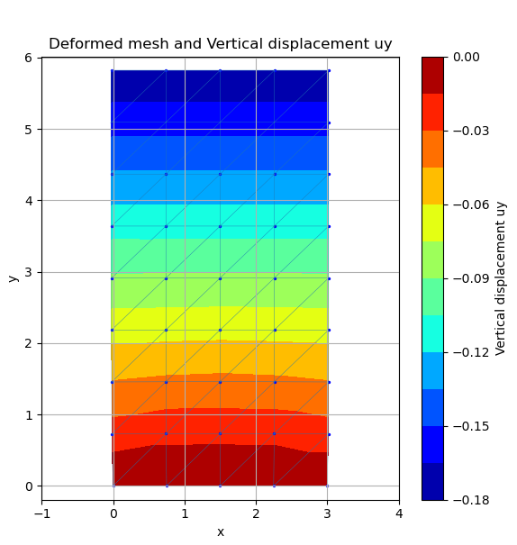

# Example 01: Linear Elastic Compression of a Rectangular Domain

This example is a basic verification problem for **GeoPyFEM**. A homogeneous rectangular domain is subjected to a uniform vertical compressive traction along its top boundary and analysed using a **2D plane-strain, linear-elastic** formulation.

The example is intended to verify the basic GeoPyFEM workflow:

- importing a Gmsh mesh,
- reading Gmsh physical groups,
- assigning a linear-elastic material,
- applying displacement boundary conditions,
- applying distributed boundary traction,
- solving a static linear problem, and
- post-processing the displacement field.

The numerical result is compared with a simple analytical reference solution.

---

## Problem definition

The model consists of a rectangular domain with width $B=3$ m and height $H=6$ m.

| Parameter | Value |
|---|---:|
| Width, $B$ | 3 m |
| Height, $H$ | 6 m |
| Young's modulus, $E$ | 30,000 kPa |
| Poisson's ratio, $\nu$ | 0.30 |
| Top traction, $q$ | -1,000 kPa |
| Formulation | Plane strain |
| Analysis | Static, linear elastic |

The bottom boundary is fully fixed,

$$
u_x=0, \qquad u_y=0,
$$

while the left and right boundaries are free. A uniform vertical compressive traction is applied along the top boundary,

$$
t_x=0, \qquad t_y=-1000\ \text{kPa}.
$$

A negative value denotes compression in the vertical direction.



*Figure 1. Example 01 problem definition: geometry, mesh, material properties, boundary conditions, and applied traction.*

---

## Geometry and mesh

The geometry is defined in `example01.geo` and meshed with Gmsh.

```geo
Point(1) = {0, 0, 0, 1.0};
Point(2) = {3, 0, 0, 1.0};
Point(3) = {3, 6, 0, 1.0};
Point(4) = {0, 6, 0, 1.0};
```

A structured transfinite mesh is generated using:

```geo
Transfinite Curve {1, 3} = 5 Using Progression 1;
Transfinite Curve {4, 2} = 9 Using Progression 1;
Transfinite Surface {1};
Recombine Surface {1};
```

This gives:

- 4 elements in the $x$-direction,
- 8 elements in the $y$-direction,
- $\Delta x=\Delta y=0.75$ m,
- 32 four-node quadrilateral elements, and
- 45 nodes.



*Figure 2. Structured quadrilateral mesh generated in Gmsh.*

> **Note:** Diagonal lines that may appear in contour plots are introduced only by the post-processing triangulation used for plotting. The computational mesh itself contains quadrilateral elements.

---

## Gmsh physical groups

The following physical groups are defined in Gmsh:

```geo
Physical Curve("bottomfix", 5) = {1};
Physical Curve("load", 6) = {3};
Physical Surface("soil1", 7) = {1};
```

| Physical group | Entity | Purpose |
|---|---|---|
| `bottomfix` | Bottom curve | Fixed displacement boundary |
| `load` | Top curve | Uniform vertical traction |
| `soil1` | Surface | Material region |

GeoPyFEM uses these names directly when reading the XML problem definition.

---

## GeoPyFEM input

The analysis is defined in `example01.xml`.

### Analysis formulation

```xml
<Dimension>2D</Dimension>
<Formulation>plane_strain</Formulation>
```

The problem is therefore solved as a two-dimensional plane-strain analysis.

### Mesh

```xml
<Mesh>
    <File>example01.msh</File>
    <Format>gmsh</Format>
</Mesh>
```

The element type and connectivity are read directly from the Gmsh mesh.

### Material

The `soil1` region uses the linear-elastic constitutive model:

```xml
<Material id="1"
          name="soil1"
          region="soil1"
          model="LinearElastic">
    <Parameters>
        <E>30000.0</E>
        <nu>0.30</nu>
    </Parameters>
</Material>
```

Hence,

$$
E=30000\ \text{kPa}, \qquad \nu=0.30.
$$

### Boundary condition

The base is fixed in both directions:

```xml
<DisplacementBoundary name="base_fix"
                      group="bottomfix">
    <ux>fixed</ux>
    <uy>fixed</uy>
</DisplacementBoundary>
```

so that

$$
u_x=u_y=0 \qquad \text{at } y=0.
$$

### Applied load

The top boundary is subjected to a uniform vertical traction:

```xml
<BoundaryLoad name="top_load"
              group="load"
              type="traction">
    <tx>0.0</tx>
    <ty>-1000.0</ty>
</BoundaryLoad>
```

The traction is integrated along the boundary by the finite-element formulation; it is not manually converted into equal nodal forces.

### Analysis and solver

```xml
<Analysis>
    <Type>static</Type>
    <Procedure>linear</Procedure>
    <Gravity enabled="false">
        <gx>0.0</gx>
        <gy>-9.81</gy>
    </Gravity>
</Analysis>
```

Gravity is disabled, so the uniform surface traction is the only applied load.

The linear system is solved with the direct solver:

```xml
<LinearSolver>direct</LinearSolver>
```

The example also enables a Matplotlib plot of the vertical displacement:

```xml
<Matplotlib enabled="true"/>
<Displacement>uy</Displacement>
<DeformationScale>1.0</DeformationScale>
```

---

## Running the example

From the GeoPyFEM repository root, run:

```bash
python3 main.py examples/example01/example01.xml
```

Adjust the path if the example directory is stored elsewhere.

---

## Numerical result

The calculated vertical displacement field is shown below.



*Figure 3. Deformed mesh and vertical displacement $u_y$.* 

The response shows the expected behaviour:

- $u_y=0$ along the fixed base,
- downward displacement increases with height,
- displacement contours are approximately horizontal,
- the response is symmetric about the vertical centreline, and
- the maximum vertical displacement at the top is approximately

$$
u_{y,\mathrm{top}}^{\mathrm{FEM}}\approx-0.18\ \text{m}.
$$

Because the complete bottom boundary is fixed in both directions, a local two-dimensional boundary effect is expected near the base, where lateral Poisson deformation is restrained.

---

## Analytical validation

A simple analytical reference can be obtained for the nearly uniform stress state away from the fixed base.

For isotropic linear elasticity,

$$
\varepsilon_y =\frac{1}{E}\left[\sigma_y-\nu(\sigma_x+\sigma_z)\right].
$$

For plane strain,

$$
\varepsilon_z=0.
$$

Therefore,

$$
0=\frac{1}{E}\left[\sigma_z-\nu(\sigma_x+\sigma_y)\right],
$$

which gives

$$
\sigma_z=\nu(\sigma_x+\sigma_y).
$$

Away from the fixed base, the vertical sides are traction-free, so the in-plane horizontal stress may be approximated as

$$
\sigma_x\approx0.
$$

Hence,

$$
\sigma_z=\nu\sigma_y.
$$

Substituting into the vertical strain equation gives

$$
\varepsilon_y=\frac{\sigma_y}{E}(1-\nu^2).
$$

This can also be written using an effective vertical modulus,

$$
E_{\mathrm{eff}}=\frac{E}{1-\nu^2}.
$$

For

$$
E=30000\ \text{kPa},\qquad\nu=0.30,\qquad\sigma_y=-1000\ \text{kPa},
$$

we obtain

$$
E_{\mathrm{eff}}=\frac{30000}{1-0.3^2}=32967.03\ \text{kPa}.
$$

The vertical strain is therefore

$$
\varepsilon_y=\frac{-1000}{32967.03}=-0.03033.
$$

For $H=6$ m,

$$
u_y=\varepsilon_y H,
$$

and therefore

$$
u_y=(-0.03033)(6)=-0.1818\ \text{m}.
$$

The analytical reference displacement is thus

$$
\boxed{u_{y,\mathrm{top}}^{\mathrm{analytical}}\approx-0.182\ \text{m}}
$$

or approximately $-182$ mm.

---

## Comparison

| Solution | Top vertical displacement |
|---|---:|
| Analytical reference | $-0.1818$ m |
| GeoPyFEM | $\approx-0.18$ m |

Using the rounded value read from the plot, the relative difference is approximately

$$
\frac{|0.1800-0.1818|}{0.1818}\times100\%\approx1.0\%.
$$

The analytical expression is intended as a **global verification reference**, not as an exact pointwise solution near the fixed base. The analytical derivation assumes $\sigma_x\approx0$, whereas the fully fixed base locally restrains lateral deformation.

The numerical displacement magnitude and overall displacement pattern nevertheless agree closely with the analytical reference.

For comparison, a simple uniaxial plane-stress calculation would give

$$
u_y=\frac{\sigma_y}{E}H=\frac{-1000}{30000}(6)=-0.200\ \text{m}.
$$

The GeoPyFEM result of approximately $-0.18$ m is therefore consistent with the intended plane-strain formulation.

---

## Verification criteria

This example is considered successful when:

- the mesh contains 32 Quad4 elements and 45 nodes,
- `soil1` is assigned the linear-elastic material,
- `bottomfix` enforces $u_x=u_y=0$,
- `load` applies a uniform downward traction of $-1000$ kPa,
- vertical displacement is zero along the base,
- $|u_y|$ increases approximately with height,
- the top vertical displacement is close to $-0.182$ m, and
- the response is symmetric about the vertical centreline.

---

## Example files

```text
example01/
├── example01.geo
├── example01.msh
├── example01.xml
├── example01_problem_definition.png
├── example01_gmsh_mesh.png
├── example01_ydisplacement.png
└── README.md
```

| File | Description |
|---|---|
| `example01.geo` | Gmsh geometry, physical groups, and mesh definition |
| `example01.msh` | Gmsh mesh read by GeoPyFEM |
| `example01.xml` | GeoPyFEM problem definition |
| `example01_problem_definition.png` | Schematic of the benchmark problem |
| `example01_gmsh_mesh.png` | Gmsh mesh illustration |
| `example01_ydisplacement.png` | Vertical displacement result |
| `README.md` | Example documentation and validation |

---

## Unit convention

The example uses kPa for stress quantities:

$$
E=30000\ \text{kPa},
$$
$$
\qquadq=-1000\ \text{kPa}.
$$

The current XML metadata contains:

```xml
<Length>m</Length>
<Force>N</Force>
<Time>s</Time>
```

If the `<Units>` block is currently descriptive only and GeoPyFEM does not perform automatic unit conversion, this does not affect the numerical result because the elastic modulus and applied traction use the same numerical stress scale.

If automatic unit conversion is introduced later, the metadata should be made consistent with the intended stress unit. With length in metres, using force in **kN** gives

$$
1\ \text{kN/m}^2=1\ \text{kPa}.
$$

---

## Summary

Example 01 verifies the basic linear-elastic GeoPyFEM workflow from Gmsh mesh import through post-processing. The calculated maximum vertical displacement is approximately

$$
\boxed{u_y\approx-0.18\ \text{m}},
$$

which is in close agreement with the analytical reference value

$$
\boxed{u_y\approx-0.182\ \text{m}}.
$$

This benchmark therefore provides a simple check of mesh import, material assignment, boundary conditions, traction loading, plane-strain elasticity, the linear solver, and displacement post-processing.
